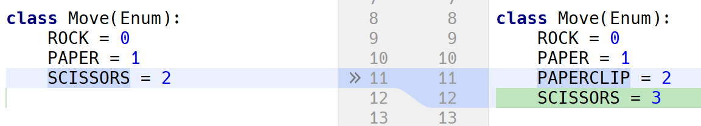
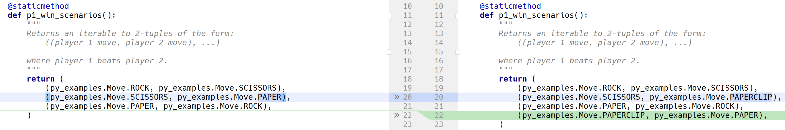
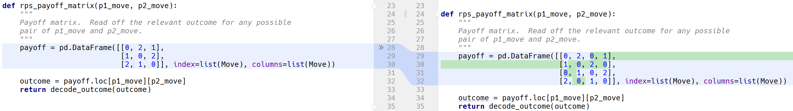
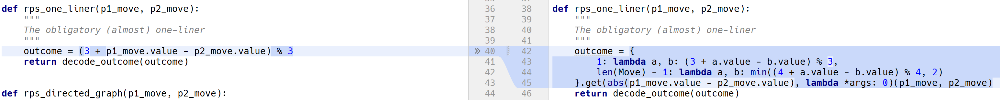

# Approaches using Python

**1st April 2018**

The following are examples of non-OO approaches to the Rock-Paper-Scissors game
using pure Python; the commentary below relates to extension of the game to
support a fourth move (paperclip).

## Update unit tests

Start by updating the Move enum:



...and test expectations:




## Payoff matrix

This approach uses an explicitly defined payoff matrix.
To adapt to our change in business requirement, we need simply to update the matrix:



## The obligatory one-liner

As an occasional code golf enthusiast (albeit one with a pretty poor handicap), it 
would seem remiss not to include the following bogey:



## Directed graph

This approach (loosely) models the problem as a directed graph where each vertex
has an edge which 'points at' the vertex which it beats and 'is pointed at' by
the vertex which it is beaten by.  In abstract:

```
 _______        _______
|       | ---> |       |
| Node0 |      | Node1 |
|_______| <--- |_______|

```

The graph structure is wholly inferred from the ordering of the enum member 
values.  As such, so changes are required over and above updating the enum.

## Others

There are some interesting solutions using truth tables which involve binary / 
one-hot encoding of possible moves and composition of OR, AND and NOT logic to
determine outcome.  But even the vanilla Rock-Paper-Scissors is laborious to
encode and its extension to 4 moves is even more so.
