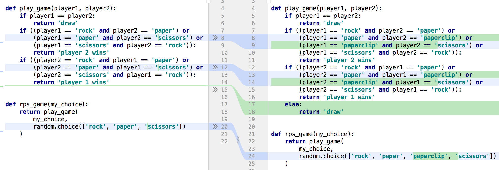
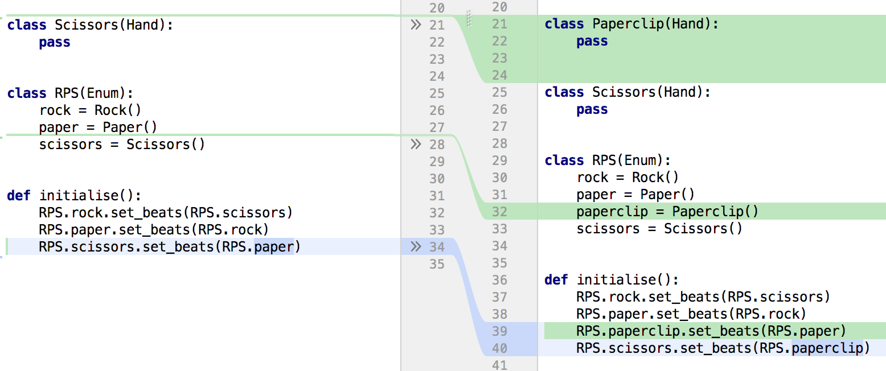

# Maintainability through removing `if` statements

**18th March 2018**

This lesson is designed to convey one of the most important concepts
you need to consider when designing software: maintainability.

*Maintainable* code is code that can be updated at a fixed cost - ie,
the amount of time required to implement a certain piece of functionality
should not increase as the software grows.

This is extremely important, and there are countless software projects
which have been shut down, or changed to support-mode only, because the
development team could not make forward progress.

In other words, if you want an interesting career building software
instead of being on support, make sure your software is correct *and*
maintainable.

- We will use the well known game [rock-paper-scissors](https://en.wikipedia.org/wiki/Rock%E2%80%93paper%E2%80%93scissors) as our target
software.
- We will implement this using a naive approach.
- We will then implement this using a graph and Enum-based approach, without
using if-statements or string comparisons.
- We will then modify the rules of the game as a proxy for the real-world
situation of business requirements changing, and see how much each
implementation needs to be modified to satisfy the new requirements.

### Rock-paper-scissors

This is a simple game - we have two players, each of which could have chosen
one of three hand gestures. If both players choose the same gesture, the
round is a draw, otherwise one of the hands will always beat the other.

The naive way of implementing this is with `if`-statements (I have seen
professional developers write code similar to this - this is extremely bad
code for many reasons, do not use this for anything other than learning!):

```python
import random


def play_game(player1, player2):
    if player1 == player2:
        return 'draw'
    if ((player1 == 'rock' and player2 == 'paper') or
        (player1 == 'paper' and player2 == 'scissors') or
        (player1 == 'scissors' and player2 == 'rock')):
        return 'player 2 wins'
    if ((player2 == 'rock' and player1 == 'paper') or
        (player2 == 'paper' and player1 == 'scissors') or
        (player2 == 'scissors' and player1 == 'rock')):
        return 'player 1 wins'


def rps_game(my_choice):
    return play_game(
        my_choice,
        random.choice(['rock', 'paper', 'scissors'])
    )
```

Obviously we could pull the boolean logic out into a separate function,
but it's left as-is for clarity.

Using the code above at the python interpreter, we can play a simple
game of rock-paper-scissors against the computer:

```bash
 In[7]: rps_game('rock')
Out[7]:
'player 2 wins'
 In[8]: rps_game('rock')
Out[8]:
'draw'
```

### Removing `if`-statements and string comparisons

One of the recurring themes I've noticed across all projects is that good
code doesn't require `if`-statements. The better programmers on a team will
usually find a way to avoid them, and most silly logic errors which cause
fragility/test failures tend to come from `if`-statements.

The same can be said for string comparisons, ie `player1 == 'rock'`, which
tend to lend themselves to `if`-statements, and are in my mind a very serious
warning that the code has not been written properly.

A couple of years ago, whilst teaching an App Development course, we wrote a version of
rock-paper-scissors without `if`-statements or string comparisons,
which [you can find here](https://github.com/FutureTechCity/CroydonCollegeAppDev/blob/master/rock_paper_scissors/main.py)

It's a bit more verbose than the naive version above, but we can take a few
small steps to see how to get there from the logic above.

#### A better way to represent the business logic

The naive logic above is simply writing out every permutation of player
choices and selecting the result based on that. This may seem normal, but
there's actually no abstraction or wrapping of the underlying concepts in
the code above.

The [wikipedia page](https://en.wikipedia.org/wiki/Rock%E2%80%93paper%E2%80%93scissors)
gives us an enormous hint for the game logic in the diagram on the right -
the underlying concept of the game is a cyclic graph. If you take a forward arrow
(->) to mean `beats`, then the game is represented by `Rock -> Scissors -> Paper -> Rock`

We can represent this simply in object-oriented paradigms by using 3
objects which reference each-other (if you prefer another paradigm which
has a more elegant solution, please submit a PR with your preferred
solution, as discussed at the end):

```python
class Hand:
    def __init__(self):
        self._beats_hand = None

    def set_beats(self, other):
        self._beats_hand = other


class Rock(Hand):
    pass


class Paper(Hand):
    pass


class Scissors(Hand):
    pass


class RPS(Enum):
    rock = Rock()
    paper = Paper()
    scissors = Scissors()


def initialise():
    RPS.rock.set_beats(RPS.scissors)
    RPS.paper.set_beats(RPS.rock)
    RPS.scissors.set_beats(RPS.paper)
```

This is a cut-down version of the logic in the other repo linked above -
the central part of the game is to ensure that there's a `rock` object
which is set to `beat` the `scissors` object, and the `scissors` is set
to `beat` the `paper` object etc.

This is encapsulated in the last 3 lines in the code above.

This forms a graph in memory, and the rest of the linked repo logic is
purely boilerplate to turn this logic into a workable game.

This is an important point - most underlying 'business logic' that you
will need to implement in the real-world can (and should) be represented
as a graph.
This makes a huge amount of testing/validation/modification much easier
than a bunch of `if-else` statements.

> Whenever you see someone add in a quick 2-line ``if some_flag:``
change, they are almost certainly adding to your long-term support burden.
Take a deeper look at the change and try to work out what business logic
hasn't been modelled properly.

### Changing business requirements

As all professional programmers will know - usually the business
doesn't really know what it needs, and even if it does, the initial
requirements will still be wrong.

This is a factor that is partially out of our control, and makes it
even more important to have a clean code base - clean code can be
refactored/modified more easily.

To simulate a complete change of business requirements, let's pretend
that we've been asked to change the entire logic of the game. Instead
of only 3 items to choose from, we actually want 4. Let's call the 4th
item a paperclip.

Currently we have ``Rock (beats) Scissors (beats) Paper (beats) Rock``

With the new requirements we have ``Rock (beats) Scissors (beats) Paperclip (beats) Paper (beats) Rock``

For the sake of simplicity, if the players choose items which are not
directly connected in this graph, we will call it a draw.

In the naive version, making this change gives a diff file like this
(this is the diff viewer from PyCharm, which is awesome!):



Even having just written this code, I find this fiddly and difficult to
confirm visually (regardless of whether the logic has been extracted
into a separate function). It requires a huge amount of time and effort
to be sure that the logic is correct.

In the object-oriented version, making this business requirement update
gives a diff file like this:



The amazing thing here is not only that this change took a lot less time,
but that every single line of the diff is instantly justifiable in a
code review, and is ``obviously correct`` (tm) when you know the business
requirements:

- We've added a new type of hand, resulting in an empty class definition
on lines 21-22.
- We need to add this new type to the RPS enum, resuling in a single
line addition at line 32.
- We need to add this new item into the business logic, and given the
the colouring, we can instantly see that the logic for scissors has been
modified (line 40) but the logic for paperclip has been added (line 39).

# Conclusions

``if``-statements are bad: please reduce the number of ``if`` statements
you use as much as physically possible.

We have shown here that even a simple toy class hierarchy with empty
class definitions in an enum significantly improves the
maintainability of our code.

This goes hand-in-hand with reducing the number of strings in our code
as well.

We should always strive to write code which is ``obviously correct``,
and we should always strive to architect code so that diff files will
be ``obviously correct``. This precludes the use of ``if``-statements
and string comparisons.

An important item to note: even if the 'better' architecture requires
more lines of code to start with, it is always better in the long-run
to architect software properly, instead of writing ``if``-statements.

# Tasks

- We have shown that a simple object-oriented (OO) approach simplifies future code changes; try to find a new, non-OO approach which also makes this code modification much easier. (Hint: Try different languages - Rust has traits, Haskell has typeclasses).
- Submit a PR with a markdown file showing your rock-paper-scissors solution and the diff required to update for the paperclip requirement.
