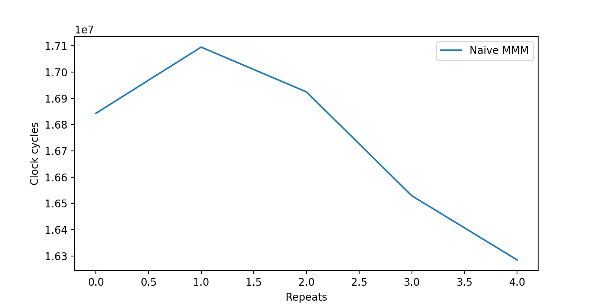
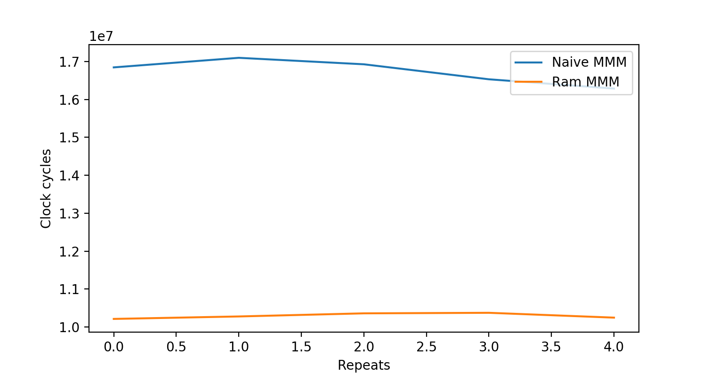
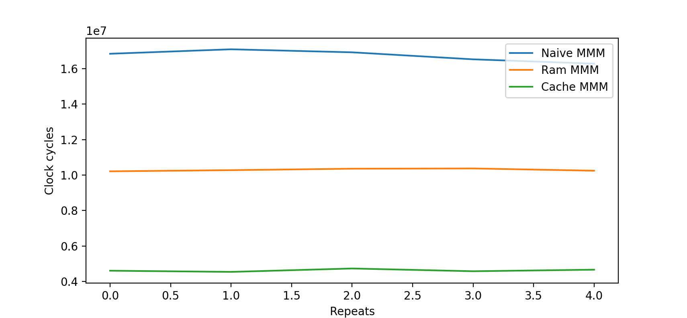
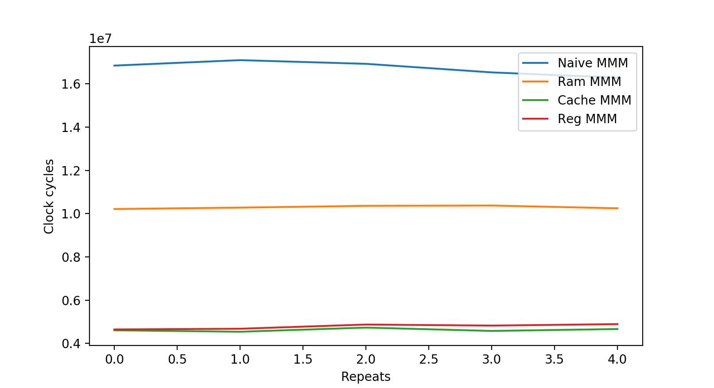
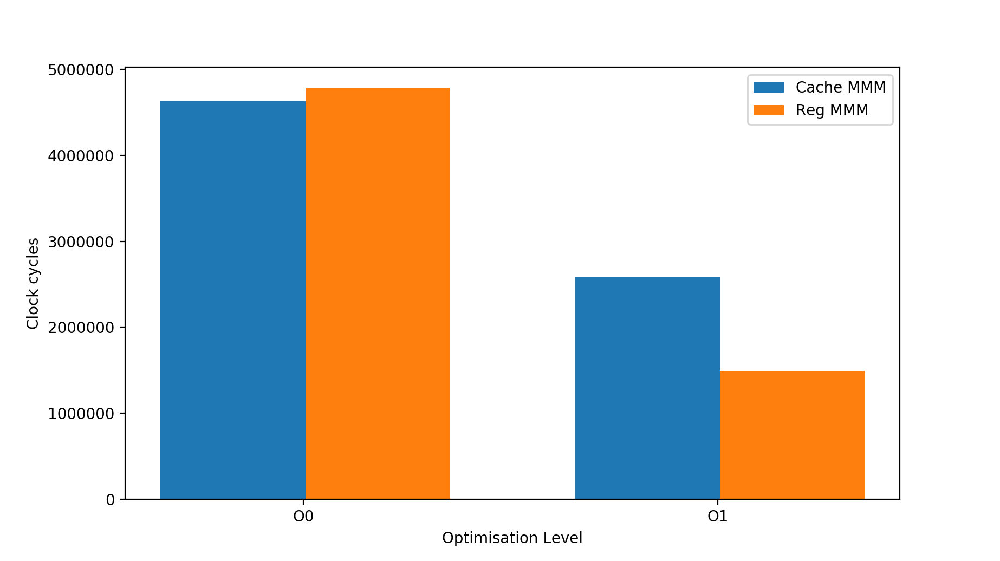

# Performance Basics

*30th June 2017*, by Dave Willmer

This is the first in a series of posts designed to convey the basic
 concepts and tools for writing performant code.
An intermediate programming ability in one of the major languages is assumed.

- We will cover the basics of assembly programming, and looping in assembly,
  in order to facilitate future debugging in gdb/lldb.
- We will then take one of the main building blocks of linear algebra
  (matrix-matrix multiplication), and implement it in simple,
  unoptimised C code.
- This will then be improved by optimising data and code for RAM accesses.
- This will then be improved to better fit the CPU cache hierarchies.
- This will then be improved again to better suit the CPU registers.

Overall this lesson will show multiple techniques for numerical optimization,
it will build intuition about how code changes affect performance,
and will improve knowledge about assembly/C.

### Intro to hardware

As programmers we are used to hearing that disk is slow and RAM is fast, so keep what you need in memory.
In reality it's much more complicated than that; not only should we only
load the smallest amount of data we need (otherwise programs won't scale well),
but accessing RAM is much slower than having the data in CPU caches / registers - here's some numbers
[from Peter Norvig](http://norvig.com/21-days.html#answers):

| Operation               | Latency (nanoseconds) |
| ----------------------- | --------------------: |
| L1 cache reference      | 0.5 |
| Branch mispredict       | 5 |
| L2 cache reference      | 7 |
| Mutex lock/unlock       | 25 |
| Main memory reference   | 100 |


Here's an approximation of cache latencies, from [this discussion on Reddit](https://www.reddit.com/r/hardware/comments/5zvxm0/eli5_why_are_l3_caches_in_cpus_so/)


Obviously the numbers are hardware-dependent, and are changing all the time,
but it's worth knowing that if the next piece of data the program requires
is already sitting in L1 cache/registers, then it will be hundreds of times
faster than a random access memory request.

This series of articles is about methods of architecting algorithms/software
to maximise performance given our knowledge of the hardware limitations.

### Intro to assembly

This section is purely to gain a basic understanding of assembly structure,
and to be able to debug some loops.

To start with, you will need to ensure you have [`NASM`](www.nasm.us) installed -
`NASM` is the netwide assembler, this lets us write code at almost the
lowest level possible, and is useful in order to understand the reasons
for performance limitations in current CPU architectures.

To install NASM, go to `www.nasm.us` and download the latest version.
This should work on any major operating system, and the code we write
will be largely OS-independent (if you're on Windows you may have some changes to make).

Open a command line and type `nasm` or `./nasm` in the correct directory, and confirm that you get an output like this:

```bash
nasm: error: no input file specified
type `nasm -h' for help
```

This confirms that `nasm` is installed correctly.

Here's a complete example 32-bit program in nasm:

```asm
global start

section .text

start:
    push dword msg.len
    push dword msg
    push dword 1
    mov eax, 4
    sub esp, 4
    int 0x80
    add esp, 16

    push dword 0
    mov eax, 1
    sub esp, 12
    int 0x80


section .data
msg db 'My first program', 0xf
msg.len equ $ - msg
```

If you type this into a text editor and save it as `first.asm`, you should be able to 'assemble' it using

| MacOS                   | Linux                 | Windows                 |
| ----------------------- | --------------------- | ----------------------- |
| nasm -f macho first.asm | nasm -f elf first.asm | nasm -f win32 first.asm |

This will output an object file called `first.o`, this then needs linking into an executable using `ld` (Mac/Linux) or `link.exe` (Windows):

```
ld first.o -o first
```

This will output an executable which you can run using:

```
./first
```

The output should be:

```
My first program
```

Make sure you get this output at the command line, and are comfortable running the nasm-ld-run commands (you can put them in a script to make things easier).

#### Structure of an Assembly program

- Assembly programs contain 3 parts: `data`, `bss` and `text` sections.
- The `data` section is for immutable constants.
- The `bss` section is for variables.
- The `text` section is for code.
- Functions are declared with the function name followed by a colon. The `start:` block above is a function.
- `start` is a special function, equivalent to the `main` function in C/C++ code - this is executed by default, and is the start of all assembly programs.
- `int 0x80` is the 32-bit command to execute a system call - `int` tells the hardware to perform an interrupt, `0x80` is integer 128 in hex, which on Linux/Mac tells the kernel to perform a system call.
- The exact `syscall` is determined by the value in the `eax` register. In the example above we have put `4` in the `eax` register with `mov eax, 4`, which is the syscall number for `sys_write`.

> In this way, assembler instructions may look backwards to people used to the major imperative languages (Java/C/C++/Python); in assembler, you push arguments onto the stack or into registers, then call the function name.

#### Looping in assembly

There are many dialects/instructions which allow looping in assembly, but
the basic structure is to compare two values, and repeat the previous few
instructions if they're not equal (or alternatively, if they *are* equal,
depending on the loop).

For example:

```asm
mov ecx, 10

loop:

dec ecx
cmp ecx, 0
jne loop
ret
```

This is the general pattern of for-loops in assembler. As a high level overview, this runs as follows:

- `mov ecx, 10` - Sets the value of the ecx register to 10
- `dec ecx` decrements ecx by 1
- `cmp ecx, 0` compares the new value of ecx to zero
- `jne loop` if the previous comparison result was 'not equal', then goes back to the top of the loop (ie, decrements ecx again).

Obviously this will loop around until the `ecx` register has the value zero, and then exit.

Items to note:

- `jne` stands for `jump if not-equal`, and is therefore a `conditional jump`.
This is one of the branching constructs in assembler, and because the next instruction
is dependent on the result of the previous `cmp`, it can be difficult for a CPU to
know which instruction will be executed next. This is the reason that some compilers
implement `loop-unrolling`, which reduces the number of jumps.
- `cmp` does not modify the register argument. It works by subtracting
one value from another (in this case subtracting zero from ecx), and working
out if the result is zero. If the result **is** zero, it sets the negative/carry flags
in the CPU, which are the items checked by the `jne` instruction to find out
whether to continue looping.

It should be obvious from this how to translate a Java-/C++-style for-loop into assembly code.

> **Task** update your assembler demo above to print out 'My first assembly loop' 10 times.

That's the end of our (very) brief introduction to assembler - you will
need these skills when debugging complicated nested loops in the next
section.

For a complete introduction to assembler, [read this excellent document by Agner Fog](http://www.agner.org/optimize/optimizing_assembly.pdf)

### Matrix-Matrix Multiplication (MMM)

Matrix-matrix multiplication is one of the main building blocks of linear
algebra, and is described by

```
A = BC
```

where `A`, `B` and `C` are matrices.

### Naive MMM

Here's a naive implementation of MMM in C (we actually use C++ for the
I/O parts like getting user input, but the MMM algorithm is in valid C code for simplicity):

```cpp
#include <iostream>
#include <string>
#include <time.h>
#include <sstream>

using namespace std;

int main(void) {
    const int N=1000, M=1000;
    int start, end;
    double ** C;
    double ** A;
    double ** B;
    double num = 0.0;

    string input;

    // Allocate arrays
    C = new double*[N];
    A = new double*[N];
    B = new double*[N];
    for (int q = 0; q < M; q++)
        C[q] = new double[N];
    for (int r = 0; r < M; r++)
        A[r] = new double[N];
    for (int s = 0; s < M; s++)
        B[s] = new double[N];

    // Get user input (stops compiler optimising this away)
    cout << "Enter a number: ";
    getline(cin, input);
    stringstream input_stream(input);
    input_stream >> num;

    cout << "Initialising...";
    for (int a = 0; a < N; a++) {
        for (int b = 0; b < N; b++) {
            C[a][b] = num;
            A[a][b] = num * 2.0;
            B[a][b] = num * 3.0;
        }
    }
    cout << "complete." << endl;


    // Perform MMM
    cout << "Calculating..." << endl;
    start = clock();
    for (int k = 0; k < N; k++) {
        for (int j = 0; j < N; j++) {
            for (int i = 0; i < N; i++) {
                C[i][j] += A[i][k] * B[k][j];
            }
        }
    }
    end = clock();

    cout << "Clocks: " << end - start << endl;

    return 0;
}
```

You should type this out and compile it **with zero optimizations**, for example on linux/mac use:

```
g++ mmm_naive.cpp -o mmm_naive -O0 -Wall -pedantic
```

Before we discuss the code, let's discuss the compilation options:

* `g++` - The compiler. This could be `clang++`, if you use Windows you will have to use something else.
* `mmm_naive.cpp` - The name of the file we want to compile.
* `-o mmm_naive` - Tells the compiler to name the resulting output executable `mmm_naive`.
* `-O0` - Optimization level zero. change to `-O1`, `-O2`, or `-O3` for more advanced optimizations.
* `-Wall -pedantic` - This turns on (almost) all available compiler warnings. **Always** use this. If the compiler flags anything, you've made a mistake.

For the purposes of learning about **code** optimizations, we will start with the **compiler** at optimization-level zero `-O0`, but we will use the other options later for comparison.

**Task** - Save the code above as `mmm_naive.cpp` and ensure you can compile and run the code on your PC.

You should get an output like this:

```
dave @ Daves-MBP - performance:g++ mmm_naive.cpp -O0 -o mmm_naive -Wall -pedantic
dave @ Daves-MBP - performance:./mmm_naive
Enter a number: 5.5
Initialising...complete.
Calculating...
Clocks: 16843164
```

Make sure (1) you have zero compiler warnings and (2) you get a fairly high number of 'Clocks' printed at the terminal.

The `clocks` value is the number of CPU clock cycles taken to calculate the MMM, in my case ~16.8 million. This `clocks` value is the number we are going to use as a rudimentary profile of our MMM algorithm performance.

> If you see `Segmentation Fault`, then you've probably made a mistake in the code. Try adding `-g` to the command line options, which will add debug symbols to the binary, and run the binary using a debugger like gdb/lldb. You will find excellent instructions for gdb [here](https://beej.us/guide/bggdb/)

The various sections of the C code should be fairly obvious, even for those with little C experience.

The main part we care about is the MMM part:

```cpp
    for (int k = 0; k < N; k++) {
        for (int j = 0; j < N; j++) {
            for (int i = 0; i < N; i++) {
                C[i][j] += A[i][k] * B[k][j];
            }
        }
    }
```

As you can see, there's 3 nested for-loops iterating over the length of the matrix, making this algorithm cubic (ie, scales as `n^3`).

Repeating this program 5 times, we get roughly similar results each time:



which is hovering around 16-17 million clock cycles.

A simple mean calculation gives us ~16.7 million clock cycles. This will be our baseline value for comparing optimizations.

> **Task** - Compile and run this code on your machine, and ensure the outputs are similar (your clock cycle count will be different).

### RAM-optimised MMM

Where we allocate the arrays in the C code above, we are allocating a new array of doubles for each item in the `C`, `A` and `B` arrays.

The way the C language manages this is usually referred to as `row-major order`, meaning that the first axis you index iterates over the rows. The opposite to this is `column-major order` which is used by Fortran.

What this means is that the loop constructs above are **not** fetching data items that are close to eachother in memory.

An in-depth description of this memory layout [can be found in Eli Bendersky's article here](http://eli.thegreenplace.net/2015/memory-layout-of-multi-dimensional-arrays/)
(highly recommended reading), but the main concept is illustrated nicely
by the first image in that article:


By iterating in across columns first (0,0 -> 1,0 -> 2,0), we are having to skip over items in the
contiguous block in memory. If we iterate across the rows first (0,0 -> 0,1 -> 0,2), then we are accessing
this piece of memory sequentially. Sequential access is **much** faster.

The simplistic way to think about this is that computers are heavily optimised for streaming a large block of contiguous data from main memory (RAM) to the processor.

The slightly more accurate way of understanding this is that every request to RAM actually fetches more data that you need - it automatically picks up the next few items as well.

As a result, if you access items in the same order as they are in RAM (0,0 -> 0,1 -> 0,2),
you won't have to continually go to RAM, as the second, third,
fourth requests will already have the data available in the CPU caches.

If you recall the latencies from the start of the article, this will be hundreds of times faster.

To optimise the code above for RAM/memory layout, we therefore need to reverse the order of the for-loops from `kji` to `ijk`:

```cpp
    for (int i = 0; i < N; i++) {
        for (int j = 0; j < N; j++) {
            for (int k = 0; k < N; k++) {
                C[i][j] += A[i][k] * B[k][j];
            }
        }
    }
```

Here's the clock cycle timings for the RAM-optimised algorithm as well as the original naive version:



As you can see, simply ensuring that we iterate over contiguous blocks of memory reduces the runtime from ~16.7 million to ~10.3 million clock cycles.

My preferred way to represent this is by saying the RAM-optimised algorithm has ~61% of the runtime of the naive algorithm.

> **Task** - Modify the program you compiled above to implement this RAM-optimisation, and compare clock cycle counts.

### Cache-optimised MMM

Now the code is iterating over the matrices in contiguous order, there's
not much we can do to optimise the RAM-to-CPU part of the runtime
(other than compressing the data, but that's beyond the scope of this
introduction and will be covered in later lessons).

After being moved from RAM to the CPU, the data are sitting in
`cache lines` in the CPU caches, usually 64 bytes wide.

In a conceptually similar way to the RAM optimization where we want to
iterate over the data in the same order as it is in RAM, we also want to
iterate over the data in the cache lines in a manner which minimises `cache misses`.

A `cache miss` is where data is requested but is not available in the cache.
Modern superscalar CPUs are very good at ensuring data is available when
needed, but they are far from perfect, so it is still useful to help the
compiler/CPU where possible.

One technique to optimise cache access is referred to as `Loop Tiling` or `Loop Blocking`,
with a nice article from Intel [discussing the benefits here](https://software.intel.com/en-us/articles/how-to-use-loop-blocking-to-optimize-memory-use-on-32-bit-intel-architecture).

The important point here is that we re-use items already in the cache by
performing as many computations on a small `tile` of data as possible, before
moving onto the next tile. This stops us continually evicting items from
the cache, and then re-requesting the same data later.

To implement this, we will need to **define an integer which controls the size of the blocks**:

```cpp
const int b = 20;
```

and we modify the algorithm as follows:

```cpp
    for (int i = 0; i < N; i+=b) {
        for (int j = 0; j < N; j+=b) {
            for (int k = 0; k < N; k+=b) {

                for (int ii = i; ii < (i + b); ii++) {
                    for (int jj = j; jj < (j + b); jj++) {
                        for (int kk = k; kk < (k + b); kk++) {
                            C[ii][jj] += A[ii][kk] * B[kk][jj];
                        }
                    }
                }
            }
        }
    }
```

Items to note:

- the original loops are no longer iterating linearly - the final terms in the for-loops have changed from `x++` to `x+=b`, as we are striding over the size of the block.
- the new loops then iterate across these strided blocks linearly, thereby reducing cache misses, and reusing items already in the caches.

Timing this Cache-optimised algorithm gives us this:



This Cache-optimized MMM has an average of ~4.6 million clock cycles, which is:

 - ~44% of the runtime of the RAM-optimized algorithm
 - ~27% of the runtime of the naive algorithm

**This may seem counter-intuitive at first, but adding another set of nested for loops inside the main loops has reduced cache misses, consequently reducing runtime by over 50%.**

> **Task** - find the optimal block size(s) for your hardware. Submit your graphs as PRs along with the CPU model info. (Hint: you should be able to find block sizes that are optimal for each of the L1, L2 and L3 caches).

### Register-optimised MMM

Now the code is iterating over the cache lines in an efficient manner, we've gone a long way to reducing cache misses (more advanced techniques will be covered in later lessons).

However, the values in the caches are still iterated over in order to pull them into the registers. This means that we can further optimise the loops to iterate in a manner which is efficient for getting cache data into the CPU registers.

In an identical manner to the Cache-optimization above, this requires an integer to define the size of the new iteration block:

```
const int c = 4;
```

and we modify the algorithm as follows:

```cpp
    // Outer loop, optimised for RAM access.
    for (int i = 0; i < N; i+=b) {
        for (int j = 0; j < N; j+=b) {
            for (int k = 0; k < N; k+=b) {

                // CPU Cache optimisation
                for (int ii = i; ii < (i + b); ii+=c) {
                    for (int jj = j; jj < (j + b); jj+=c) {
                        for (int kk = k; kk < (k + b); kk+=c) {

                            // CPU Register optimisation
                            for (int kkk=kk; kkk < (kk + c); kkk++) {
                                for (int jjj=jj; jjj < (jj + c); jjj++) {
                                    for (int iii=ii; iii < (ii + c); iii++) {
                                        C[iii][jjj] += A[iii][kkk] * B[kkk][jjj];
                                    }
                                }
                            }

                        }
                    }
                }

            }
        }
    }

```

Take a look at this carefully; this is almost the same algorithm as for
the Cache-optimization above, but with an additional set of nested loops inside.

The previous cache-optimisation loops have been modified in the same way
as before - the final loop term has been modified to stride over the
block, and the new inner loops iterate linearly over those blocks.

Timing this Register-optimised algorithm gives us this:



This may be somewhat surprising - we have implemented another optimisation
in the way we iterate over the matrix, and the register-optimised version
is slightly slower (~4.7 million clock cycles).

What has happened here is that the register optimisations won't be
fully-efficient until we let the compiler do some simple optimisations.
This is why we've only run using optimization level zero so far.

If we now compare the Cache- and Register- optimised versions at both
`-O0` and `-O1`, we see this:



The Cache-optimised and Register-optimized are at ~4.6 million and ~4.7
million clock cycles, respectively, at optimization level zero.

However, at optimisation level one (`-O1'), the cache-optimised algorithm
is at ~2.6 million clock cycles, but the register-optimised algorithm is
at ~1.5 million clock cycles.

This means that the register-optimised version with `-O1` has about 9%
of the runtime of the original naive implementation.

> **Task** - Modify your existing code to implement a register-optimised inner loop, as shown above.


### Fused-Multiply-Add (FMA)

At the time of writing (Summer 2017), Fused-Multiply-Add (FMA) is
generally regarded as the highest attainable level of performance for
CPU instructions.

Where possible, you should always ensure that code uses / optimises into
 FMA instructions. FMA instructions usually start with `fmadd` or `vfmadd`,
 but will vary depending on the platform/dialect.

FMA dictates that a CPU will perform

```
a += b * c
```

ie, it will multiply two numbers and add to a third *in a single instruction*.
This can be much faster than performing the multiplication and addition
in separate instructions.

As you may have noticed, `a += b * c` is the essence of the inner loop
of matrix-matrix multiplication (MMM).

Those of you familiar with linear algebra will now know why we started
with MMM in order to show multiple optimizations and concepts for a single
algorithm. We will move onto other linear algebra topics in later articles,
but it is worth noting that FMA forms the basis of a number of building blocks
of numerical coding, and that it has been specifically optimised in CPU hardware.

# What we've learned.

- How to read/understand simple assembly code.
- How to translate a C-loop into assembler code.
- Naive implementations of numerical algorithms are *much* slower than
optimised ones.
- Numerical optimisations can be counter-intuitive (adding for-loops can
make things *much* faster)
- We can optimise for RAM, L3, L2, L1d, L1i and CPU registers.
- Linear Algebra is a great way to learn about CPU optimisations.

# Tasks

- **Entry-level** Implement matrix-matrix multiplication (MMM) in Rust (www.rust-lang.org)
- **Intermediate** Plot a 3d graph showing block size `b` on the x-axis, block size `c` on the y-axis and number of clock cycles on the `z`-axis.
- **Expert** Use FMA intrinsics to implement the complementary error function (erfc). (TIP: use Horner's rule).