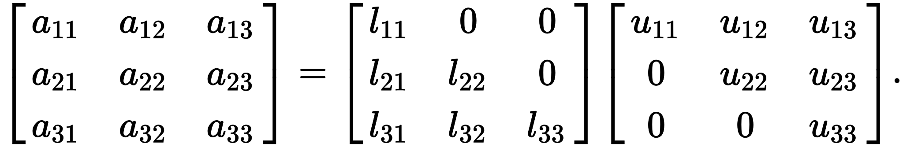
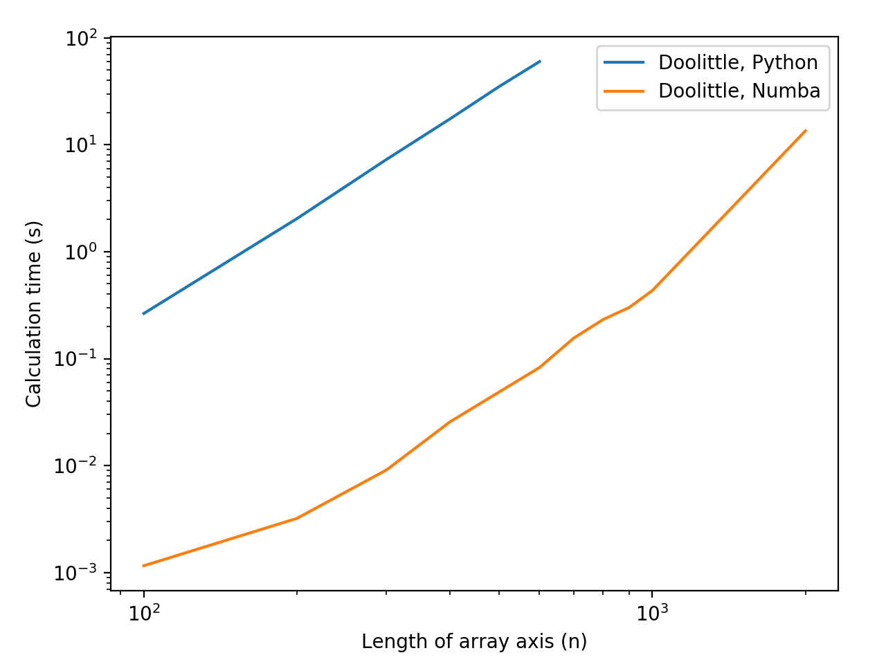

# LU Decomposition

*8th December 2017*, by Dave Willmer

In school we learn that every positive integer that's not a prime number
can be written as a `product of primes`; ie, you can formulate every
number by multiplying prime numbers together.

This is generally known as the `fundamental theorem of
arithmetic`.

For example, `15 = 5 x 3`; the prime **factors** that can be multiplied to
get the number `15` are `5` and `3`. You can think of these prime factors
as the low-level building blocks of all numbers, and as one of the building
blocks of numerical algorithms.

We can also do the same with matrices - we can usually calculate the low-level building
blocks of a matrix, which end up being extremely useful as building blocks
for many algorithms in linear algebra. However, as opposed to the real numbers
where all of them have prime factors, not all matrices can be **factorised**
into their building blocks.

Getting the prime factors of an integer is, obviously, called
`factorisation`. With matrices, this process is either called
`factorisation` or `decomposition`.

`LU Decomposition` is a specific form of matrix decomposition which gives
us the factors of a matrix as a `lower` matrix and an `upper` matrix.

A `lower` matrix is one where all values above the diagonal are zero, and
an `upper` matrix is one where all values below the matrix are zero, shown
nicely in this image [from wikipedia](https://en.wikipedia.org/wiki/LU_decomposition):



This represents a matrix multiplication between the lower and upper
matrices on the right-hand side; ie, doing a matrix multiply of `L` and
`U` returns the original matrix.

### Doolittle's Algorithm for LU Decomposition

One of the most commonly used algorithms for LU decomposition is
Doolittle's, shown below and also available in `python/doolittle.py`
from this directory:

```python
import numpy as np


def lu_decomp(x):
    """ `x` must be a N x N matrix which is decomposable
        into lower and upper triangular sections.

        :param x: The array to factorise into lower and upper
        :type x: (int_array|float_array), square

        :rtype: tuple, lu_sanity(lower @ upper == input)
    """
    assert not np.any(np.isnan(x)), "NaN values not allowed"

    lower = np.zeros_like(x)
    upper = np.zeros_like(x)

    n = len(x)

    for i in range(n):
        # Upper Triangular
        for k in range(i, n):
            total = 0.0
            for j in range(i):
                total += lower[i][j] * upper[j][k]

            upper[i][k] = x[i][k] - total

        # Lower triangular
        for k in range(i, n):
            if i == k:
                lower[i][i] = 1.0
            else:
                total = 0.0
                for j in range(i):
                    total += lower[k][j] * upper[j][i]

                lower[k][i] = (x[k][i] - total) / upper[i][i]

    return lower, upper
```

As you can see, this is a fairly simple algorithm which is discussed
mathematically [here](http://mathonline.wikidot.com/the-algorithm-for-doolittle-s-method-for-lu-decompositions):

From a performance coding perspective, this is an interesting algorithm
to work with - there are triple-nested for-loops, with an inner
multiply-add (which should sound familiar if you've followed the previous
articles). Also, note that the upper triangular section is calculated
first and is then used in the calculation of the lower triangular section,
so there is an ordering here which means certain parallel algorithms
can't be used.

In the `python` directory for this article you will also find unit-tests
for this function, and a `profile_and_plot.py` which will run this
function with arrays of increasing size for both raw python execution,
and numba execution, and will plot the runtimes.

If you run `profile_and_plot.py`, you should get something similar to
this:



As you can see, on a log-log plot, both profiles are roughly linear, with
around 3 orders of magnitude difference in runtime, purely from using
a `jit` decorator.

> *Task:* Speed up the implementation shown
  above, and produce a plot like the one above with your algorithm times
  added. Obviously yours should be below the orange line!

> *Hint:* The inner loop of both the upper and lower triangular sections
  is **very** similar to a naive matrix-multiply.
