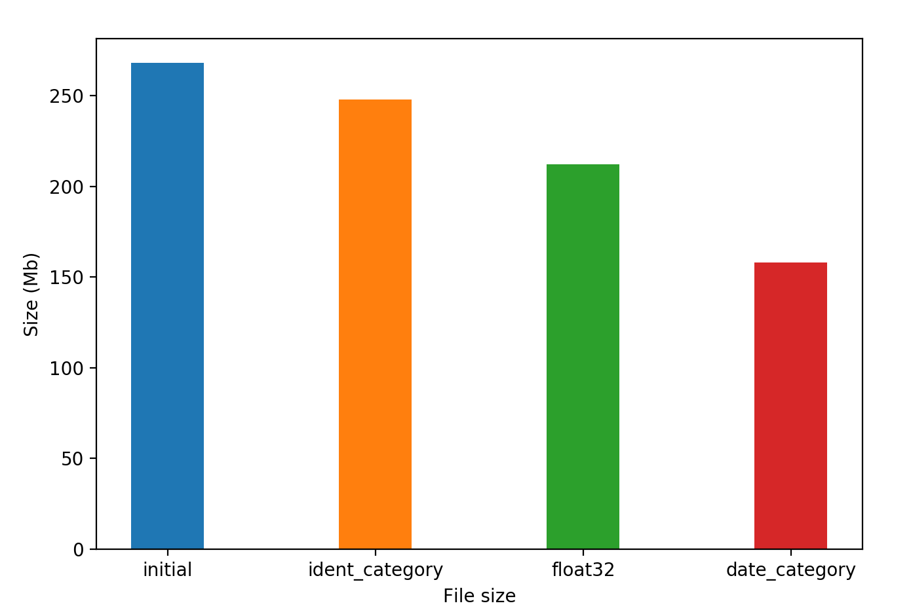
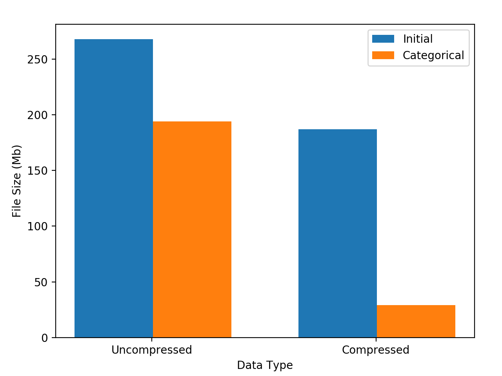

# Data Compression

As we've seen in [prior articles](../2017_06_performance_basics/readme.md),
latency and bandwidth constraints grow exponentially the further
the data is from your CPU registers. In the real world we have to
include disk and network latencies, which are significantly larger than
cache / memory as well.

One consequence of this is that compressing data in order to reduce
the bytes sent over the network, or over the data bus, *may* be
beneficial, depending on the overhead of decompressing the data once it
is received.

In this article we explore some data compression techniques that can
be used with commonly used python data structures.

### Generate some test data

Starting with the `gen_data` script in this directory, we generate a
dummy data set with 3 columns - `identifier`, `value`, `date` -
for ~3,000 dates and ~3,000 identifiers.

The initial data size is 9,003,000 rows and 3 columns.

This is representative of data from an array of IoT sensors, and is also
similar to data sets found in financial markets.

Doing an initial file write:

```python
df.to_hdf('initial.h5', key='df')
```

gives a file size of 268Mb.

On my 2015 Macbook Pro, reading this file in takes 597ms:

```bash
In [9]: %timeit df = pd.read_hdf('initial.h5', key='df')
597 ms ± 17.5 ms per loop (mean ± std. dev. of 7 runs, 1 loop each)
```

### Data Types

Let's start by dealing with the data types. The initial data types are:

```bash
In [5]: df.dtypes
Out[5]:
identifier            object
value                float64
date          datetime64[ns]
dtype: object
```

This is to be expected - the strings are stored as pointers to the
python objects, hence `object` type. This is extremely inefficient
in both space and time domains, so we will start with this.

Pandas has a built in type called 'categorical' which gives unique
integers to each value in the set, and stores the column as a numpy
array of integers. This is much more efficient in space, and stops us
repeating the same string multiple times.

To convert that column to a categorical:

```
df['identifier'] = df['identifier'].astype('category')
```

This will now show the following dtypes:

```bash
In [11]: df.dtypes
Out[11]:
identifier          category
value                float64
date          datetime64[ns]
dtype: object
```

If we now write the file to disk:

```python
df.to_hdf('category.h5', key='df', format='table')
```

we can see that we've only saved about 12Mb:

```bash
In [15]: !ls -l *.h5
-rw-r--r--  1 dave  staff  248372384  3 Jan 21:17 category.h5
-rw-r--r--  1 dave  staff  260058992  3 Jan 21:02 initial.h5
```

The read time has also slowed slightly:

```bash
In [3]: %timeit df = pd.read_hdf('category.h5', key='df')
730 ms ± 54.1 ms per loop (mean ± std. dev. of 7 runs, 1 loop each)
```

This is slightly disappointing, but the categorical has a nice property;
it compresses far better than an object column, which we'll come to
later.

Next we'll take a look at the `value` column; it's currently a float64,
but is only storing a small float. We can convert this column to 32-bit
and save exactly half the size of that column:

```python
df['value'] = df['value'].astype('float32')
```

Which when written to disk gives:

```python
df.to_hdf('float32.h5', key='df', format='table')
```

which leaves:

```bash
In [19]: !ls -l *.h5
-rw-r--r--  1 dave  staff  248372384  3 Jan 21:17 category.h5
-rw-r--r--  1 dave  staff  212451372  3 Jan 21:24 float32.h5
-rw-r--r--  1 dave  staff  260058992  3 Jan 21:02 initial.h5
```

So we see that halving the size of the float64 column saved us about
36Mb, and read time now decreases slightly:

```bash
In [7]: %timeit df = pd.read_hdf('float32.h5', key='df')
698 ms ± 42.7 ms per loop (mean ± std. dev. of 7 runs, 1 loop each)
```

The data types now look like:

```bash
In [20]: df.dtypes
Out[20]:
identifier          category
value                float32
date          datetime64[ns]
dtype: object
```

Since the date column is `datetime64`, that means we're using a full
64-bit wide storage for each date, however we're only storing a few
thousand dates, so this may also benefit from being a categorical:

```python
df['date'] = df['date'].astype('category')
df.to_hdf('date_cat.h5', key='df', format='table')
```

This gives:

```bash
In [25]: !ls -l *.h5
-rw-r--r--  1 dave  staff  248372384  3 Jan 21:17 category.h5
-rw-r--r--  1 dave  staff  158556944  3 Jan 21:28 date_cat.h5
-rw-r--r--  1 dave  staff  212451372  3 Jan 21:24 float32.h5
-rw-r--r--  1 dave  staff  260058992  3 Jan 21:02 initial.h5
```

So we appear to have saved ~90Mb by converting the date column to
categorical, and we're now at ~158Mb.

Here's a graphical representation of the file size decrease as we've
applied data type conversions:



To clarify, as we move from left-to-right in the chart above we are applying
all of the previous type conversions, so the final 'date_category' bar
is the accumulation of all of the previous conversions.

### Compression

Let's try taking this largely categorical dataframe and compressing it
on disk:

```python
df.to_hdf('comp_zlib9.h5', key='df', format='table',
          complib='zlib', complevel=9)
```

The argument `complib` specifies the compression library to use, and the
argument `complevel` specifies the compression level from 0-9, with 9
being the strongest compression (smallest file size).

This gives us:

```bash
In [14]: !ls -l *.h5
-rw-r--r--  1 dave  staff  248372384  3 Jan 21:17 category.h5
-rw-r--r--  1 dave  staff   22059208  3 Jan 22:29 comp_zlib9.h5
-rw-r--r--  1 dave  staff  158556944  3 Jan 21:28 date_cat.h5
-rw-r--r--  1 dave  staff  212451372  3 Jan 21:24 float32.h5
-rw-r--r--  1 dave  staff  260058992  3 Jan 21:02 initial.h5
```

As you can see, the size decreased to ~22Mb, which is less than 10% of
the original file size.

However, the negative aspect of the compression is that the file read
takes a lot longer:

```bash
In [15]: %timeit df = pd.read_hdf('comp_zlib9.h5', key='df')
1.71 s ± 29.7 ms per loop (mean ± std. dev. of 7 runs, 1 loop each)
```

In this case, it is over twice as long to read in as the uncompressed
file, because even though less time is spent in data transfer, more time
is spent on the decompression.

The specific compression algorithm makes a big difference here; if we
change the algorithm from the old classic `zlib` to the new algorithm
from facebook `zstd` then we get this:

```bash
df.to_hdf('comp_zstd9.h5', key='df', format='table', complib='blosc:zstd', complevel=9)
```

Which is ~10% smaller than the zlib file (and now under 20Mb):

```bash
In [17]: !ls -l
total 1799664
-rw-r--r--  1 dave  staff  248372384  3 Jan 21:17 category.h5
-rw-r--r--  1 dave  staff   22059208  3 Jan 22:29 comp_zlib9.h5
-rw-r--r--  1 dave  staff   19905946  3 Jan 22:36 comp_zstd9.h5
```

Yet this takes roughly the same amount of time (ie, within error
bounds) to read in as the uncompressed file:

```bash
In [19]: %timeit df = pd.read_hdf('comp_zstd9.h5', key='df')
572 ms ± 11 ms per loop (mean ± std. dev. of 7 runs, 1 loop each)
```

So now we have a file which will transfer over the network much faster,
but which does not have a penalty for using the compression.

#### Compressing Categoricals

As mentioned previously, categoricals not only reduce the in-memory data
size, but they have an added benefit in that they also help with
compression.

For example, if we take the `initial.h5` data set, and just make the
categorical type conversions:

```python
initial = pd.read_hdf('initial.h5', key='df')
cat = initial.copy()
cat['identifier'] = cat['identifier'].astype('category')
cat['date'] = cat['date'].astype('category')
```

and then compare the relative compressions of each of these using `zlib`
at compression `9`:

```python
cat.to_hdf('cat.h5', key='df', format='table')
initial.to_hdf('initial_comp.h5', key='df', complib='zlib', complevel=9)
cat_comp = cat.to_hdf('cat_comp.h5', key='df', complib='zlib', complevel=9, format='table')
```

then we get:




Whilst the non-categorical data goes from 268Mb to 187Mb (69.7% of the
original file size), the categorical data goes from 194Mb to 29Mb (14.9%
of the original file size).

So not only is the original file slightly smaller with categoricals,
but the data compresses much more efficiently, resulting in
considerably smaller data sets.

The main reasons for this improvement in compression are
`Run Length Encoding (RLE)`, `Delta Encoding` and
`Delta-of-Delta Encoding (DoD)`.

These are chosen/applied automatically by most modern compression
algorithms, however it helps to understand how these encodings work in
order to work out what data structures may be beneficial in the future.

#### Run-Length Encoding

`Run-Length Encoding` is the computer science term for noting how many
times an item occurs in succession within a sequence - literally
'encoding the length of the run'.

For example, if you have a series of 10 integers called `first`:

```python
first = [0, 0, 0, 0, 0, 1, 1, 1, 1, 1]
```

this could be stored more efficiently by storing the 'run', or sequence,
as a pair of integers; one for the value, and one for the number of
times it occurs.

In this case, `first` could be stored as:

```python
small_first = [(0, 5), (1, 5)]
```

The exact structure is only here for clarity, this could be stored as
`[0, 5, 1, 5]` without losing information.

This allows us to store the same information as `first`, but with only
40% of the space required.

The compression ratio improves as you have longer runs of the same data.

> Note: this is important - the benefit of RLE (run-length encoding)
  improves dramatically as you have more pieces of identical data
  in succession.

To show this, we could encode 500 zeros and 500 ones as `[0, 500, 1, 500]`,
which is exactly the same size of data as `small_first`.

> Note: Any data set which has long sequences of identical values will
  compress very well with Run-Length Encoding.

#### Delta Encoding

Sometimes called `Delta compression`, Delta encoding is the computer
science term for storing the **differences** between values.

If we take the `first` variable created above:

```python
first = [0, 0, 0, 0, 0, 1, 1, 1, 1, 1]
```

and apply a `Delta Encoding`, we would get:

```python
delta_first = [0, 0, 0, 0, 0, 1, 0, 0, 0, 0]
```

because the only index where the data value has changed is index 5 where
the value increases by `1`.

As you can see, with static/slow-moving data series we end up with a lot
of zero values, which we've already seen compress well. However, with
`Delta Encoding` we get a huge benefit from compressing linear series;
for example, let's take the range of dates in the `date` column of our
original data set.

We originally had the dates in `datetime64[ns]` format, which is
stored in memory as an integer representing a timestamp in nanoseconds.

As a result, consecutive days will always have the same difference
between them:

```python
>>> dr = pd.date_range('2019-01-01', '2019-01-05')
>>> raw = dr.astype('int')
>>> raw
array([1546300800000000000, 1546387200000000000, 1546473600000000000,
       1546560000000000000, 1546646400000000000])
```

which shows the raw integer representation used under-the-hood.

If we take the difference of the first and second values:

```python
>>> raw[1] - raw[0]
86400000000000
```

we can check that this is the same as the difference between the second
and third:

```python
>>> raw[2] - raw[1]
86400000000000
```

So we have a useful data series where the `deltas` are constant.

> Those who are paying attention will note that the time delta starts with
`864`, as there are 86,400 seconds in a day (24 * 60 * 60), and our
values are in nanoseconds.

Putting all this together means that the `date` column in our original
data set can be easily represented in `Delta Encoding` as a constant
series:

```python
delta_dates = [86400000000000, 86400000000000, 86400000000000, ...]
```

Which combined with Run Length Encoding means an entire column of
consecutive dates compresses down to a constant size, regardless of its
length. There are nuances here around the range of dates available in
nanoseconds, but the point remains that the compression is excellent
for linear series.


#### Delta-of-Delta Encoding

`Delta-of-Delta Encoding`, as you probably guessed, is a computer
science term for storing the change of the change. This is a useful
variant of `Delta Encoding`, which allows us to get excellent
compression ratios for geometric and other non-linear data sequences.

Where `Delta-of-Delta` has shown particular promise is in real-time
data streams; sequences such as real-time feeds from IoT sensors,
or financial markets tick data falls into this category.

For various reasons, this data tends to compress very well using
`Delta-of-Delta Encoding`, as the changes between values are not
constant in time or value (and hence `Delta encoding` becomes less
useful), but still varies in a time-dependent pattern.

The main reasons for the improvements in compression seen above, even
when using the same algorithm (zlib) for both categorical and
non-categorical are:

- (1) The data being compressed are now contiguous in memory
- (2) The data are sorted.

As a result, all of the encoding/compression algorithms mentioned above
have a chance at being effective here.

You will have noted already that `Run Length Encoding` applies well to
our `identifier` column, `Delta Encoding` applies well to our `date`
column, and `Delta-of-Delta Encoding` applies well to our `value`
column.

It should be remembered that the high-level compression algorithm (ie,
`DEFLATE` in the case of zip/zlib) will make choices based on the
data it finds, and that all we can usually do is format/structure the
data set in such a way that it helps the compression algorithm.

This is similar conceptually to writing code in a way that leaves
hints for the compiler. You should apply the same principles to
structuring data, whether it is in-memory, in-cache, or for persistence.

### Apache Parquet

So far we have used compression techniques which apply a single
algorithm to the entire data set; this is the default when using HDF5
compression from pandas.

Using the Apache Parquet library, however, it is possible to
automatically compress each column using a different algorithm. This
has the benefit that you could end up with significantly higher
compression ratios for each data set, at the expense of a small amount
of extra 'book-keeping'.

For example:

```python
import pyarrow as pa
import pyarrow.parquet as pq

# Create the pyarrow Table from the pandas DataFrame
table = pa.Table.from_pandas(df)

# Write the parquet file from the pyarrow Table
pq.write_table(table, 'pq_cat.par')
```

This results in a file that is 7.1Mb on my machine; this is around 1/3
of the size of the high-compression zlib HDF5 created above.

The downside of Apache Parquet is that currently the `.to_pandas()`
call when decompressing is very slow (~1 second overhead on this data
set), however this should be fixed in pandas 2.0.

This means that if network latency / bandwidth is a significant
bottleneck, then Apache Parquet format may be the best choice otherwise
standard HDF5 may be better. You will only know by testing multiple
variants and profiling systematically.

### Conclusions

- We can save significant amounts of memory by using categoricals /
  smaller float/integer representations (ie, float32)
- These changes have an additional benefit in that they compress much
  better as well.
- When structuring data for persistence, we should be conscious of
  algorithmic details such as `Run-Length Encoding`, `Delta Encoding`
  and `Delta-of-Delta Encoding` which affect the final data size
  significantly.
- The specific compression algorithm makes a big difference, not only
  in terms of the final file size, but also in terms of the time
  required to decompress.
- When faced with a problem the first thing to do is measure the time
  taken for data transfer and data compression, then make decisions
  based on those profiles.

### Tasks

- Find a compression algorithm / library which creates smaller files
  than `Parquet`, or decompresses quicker than `zstd` for this data set.
  (For any algorithms/libraries you test which aren't better, please
  also include their results in a PR so we can update this document)
- Plot a 2-d chart with `Compression Ratio` on one axis and
  `Decompression Time` on the other, to show the relative benefits of
  each of the major algorithms. It would be good to show a line for each
  algorithm showing how it changes with compression level.
- Invent a custom encoding algorithm which encodes a daily
  time series more efficiently than `Delta Encoding` when taking into
  account weekends and bank holidays.